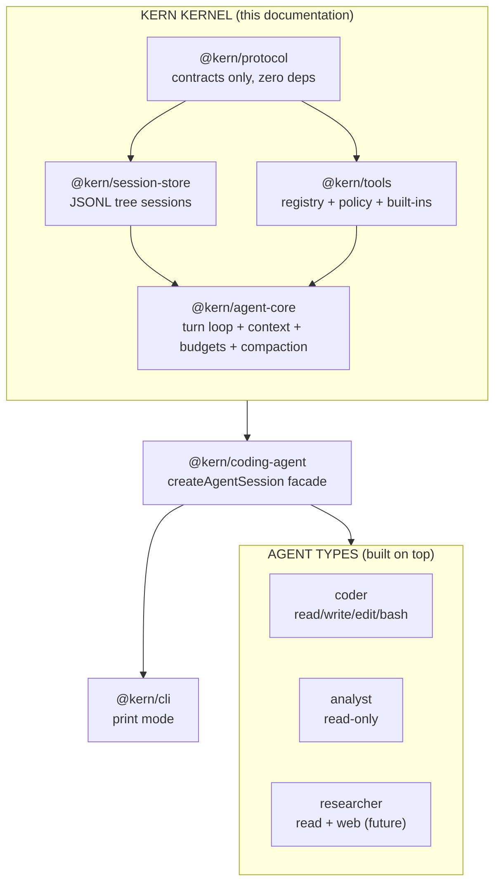
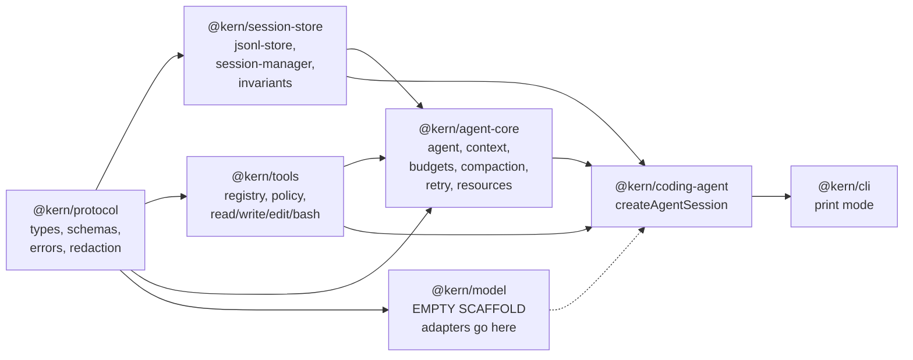

# Kern Kernel — Documentation

Detailed design documentation of the **Kern** agent kernel: the core engine
on top of which different types of agents are built.

## Reading order

| # | Document | Covers |
|---|---|---|
| 00 | `00-overview.md` (this file) | What Kern is, philosophy, package map |
| 01 | `01-protocol.md` | Shared contracts: messages, entries, events, errors |
| 02 | `02-session-store.md` | JSONL persistence, session tree, invariants |
| 03 | `03-tools.md` | Registry, policy engine, path safety, bash hardening |
| 04 | `04-agent-core.md` | Turn loop, context, budgets, compaction, retry, resources |
| 05 | `05-composition.md` | Facade, CLI, and how to build a new agent type |
| 06 | `06-safety-model.md` | Trust zones, defaults, user controls |
| 07 | `07-status.md` | What is done, what is missing, what is next |

## What Kern is

Kern is a **minimal, local-first agent kernel**. It owns everything that is
identical across agent types — the turn loop, durable state, capability
control, and observation — and owns nothing that differs between them
(system prompts, tool sets, policies, user interfaces).

## Design philosophy

1. **Small core.** The turn loop fits in one file (`agent-core/src/agent.ts`).
   Anything agent-specific lives outside the kernel.
2. **Explicit state.** Every durable fact is a JSONL entry with `id`,
   `parentId`, `timestamp`, `seq`. No hidden memory.
3. **Append-only history.** New facts are appended, never rewritten.
   Crash recovery means ignoring one trailing line, not rebuilding a database.
4. **Tree, not list.** Conversations branch. Old futures are preserved,
   never deleted.
5. **Deny by default.** Capabilities are granted explicitly through the
   policy engine. The model is untrusted input to policy, never authority.
6. **Events, not callbacks into state.** UIs observe typed events; they
   never mutate kernel internals.
7. **Fail closed.** Path escape, invalid args, corrupt session, missing
   approval — all resolve to denial or error, never to silent permission.

## Package map

Dependency rules (enforced by convention, verified by review):

- `protocol` depends on nothing.
- `agent-core` never imports CLI, TUI, or agent-type code.
- Tools never import the model adapter.
- Persistence never depends on provider SDKs.
- The facade depends inward only; CLI depends on the facade only.

## The one-sentence contract

> Given the same session branch, resources, model configuration, and tool
> results, Kern's state is understandable, inspectable, reproducible,
> and recoverable.
