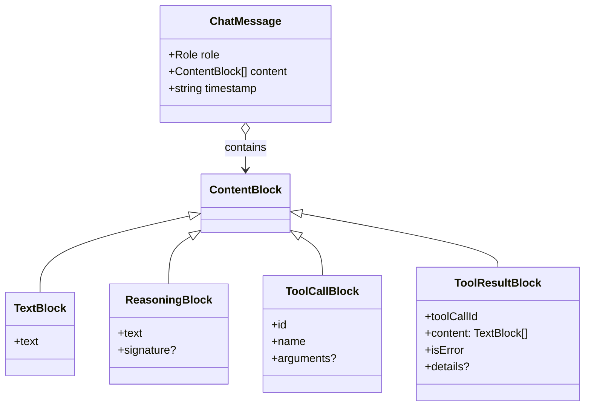
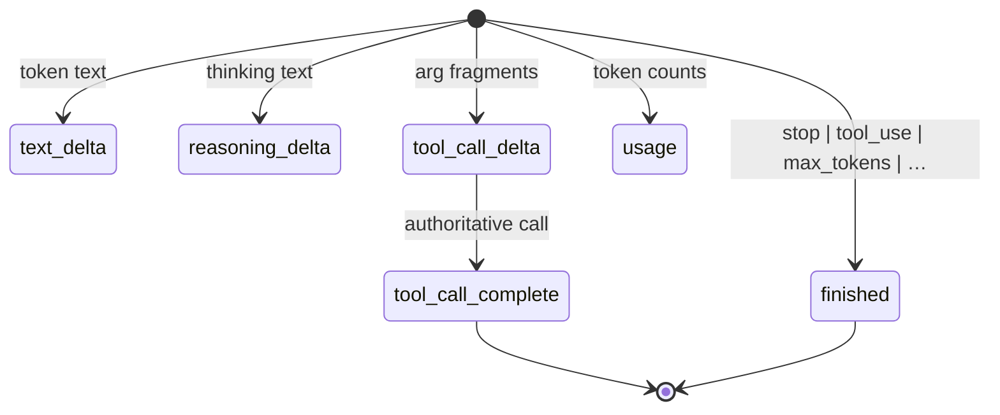
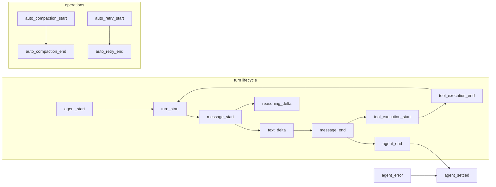

# 01 — Protocol (`@kern/protocol`)

The protocol package is the **single source of truth for every shape that
crosses a package boundary**. It has no dependencies and no runtime
behaviour beyond pure functions (validation, id generation, redaction).
If two packages must agree on a shape, that shape lives here.

Source: `packages/protocol/src/` — `core.ts`, `model.ts`, `tools.ts`,
`schemas.ts`, `util.ts`, `event-bus.ts`.

## 1.1 Messages

A conversation is a list of `ChatMessage`. The assistant side is block-based
so one message can mix text, thinking, and several tool calls.



Roles: `user | assistant | tool`. There is no persisted `system` role —
system configuration is assembled at context-build time and never stored
as a message (system text is reproducible from config + resources).

`ToolResultBlock.toolCallId` must match a preceding `tool_call` id on the
active branch. This pairing is a session invariant (see `02-session-store`).

## 1.2 Session entries (durable event log)

Every durable fact is a `SessionEntry`: a discriminated union on `type`
with a common base:

| Field | Meaning |
|---|---|
| `id` | Unique, sortable (`m_0001`, `c_0002`, …) |
| `parentId` | Causal parent; `null` only for the session header — this is what makes the tree |
| `timestamp` | ISO-8601, set by the runtime at persist time, never by the provider |
| `seq` | Monotonic sequence index assigned on append; used for compaction cutoffs and replay |

Entry variants:

| Type | Purpose |
|---|---|
| `session_header` | Root. Carries `version`, `sessionId`, `cwd`, `createdAt`, optional `meta` |
| `message` | One `ChatMessage` (user, assistant, or tool) |
| `compaction` | Structured summary + `replacesThroughId` + optional `tokensAfter` |
| `model_change` | Provider/model/thinking-level switch mid-session |
| `label` | Human or system tag on another entry (e.g. checkpoints) |
| `branch` | Marker recording `forkedFromId` + note when a branch is created |
| `extension` | `extensionName` + `event` + `payload` for plugin activity |
| `diagnostic` | `severity` + stable `code` + message + details (never secrets) |

All variants have Zod schemas in `schemas.ts` (`SessionEntrySchema` and
per-variant schemas). Loading validates every line; only the trailing line
may be quarantined (crash-during-append), everything else must validate or
the file is rejected.

## 1.3 Model contracts

Providers differ in roles, tool-schema dialect, streaming chunking, usage
fields, and stop reasons. `ModelAdapter` absorbs all of it:

```ts
interface ModelAdapter {
  readonly info: ModelInfo; // provider, modelId, contextWindow, maxOutputTokens, …
  stream(request: ModelRequest): AsyncIterable<ModelStreamEvent>;
}
```

`ModelRequest` carries `systemPrompt`, `messages`, `tools`
(provider-neutral `ModelToolSchema`), budgets, and an `AbortSignal`.
Normalized stream events:



`AssistantMessageAssembler` accumulates these into one assistant message.
Key rule: `tool_call_complete` is authoritative and supersedes any buffered
`tool_call_delta` fragments for that id — providers that stream args always
also send the complete call.

Token accounting (`TokenCounts`): `input + output + cacheRead + cacheWrite`
are **all** summed by `totalContextTokens()`. Cache traffic is billed
differently but still occupies the window — this is the Pi-style accounting
rule and the compaction gate depends on it.

## 1.4 Tool contracts

```ts
interface ToolDefinition<TArgs> {
  name: string;
  description: string;
  inputSchema: JsonSchema;   // validated BEFORE policy and execution
  sideEffect: "read" | "write" | "execute" | "network";
  instructions?: string;     // rendered into the model-facing schema
  execute(args: TArgs, ctx: ToolContext): Promise<ToolResult>;
}
```

`ToolContext` carries `cwd`, `workspaceRoot`, `signal`, an optional
`requestApproval` sink, and `emitProgress`. `ToolResult` is bounded text
plus a `details` bag (`exitCode`, `durationMs`, truncation flags,
`changedPaths`).

`OutputBudget` (`maxBytes: 30_000`, `maxLines: 400`) is enforced by
`boundText()`, which keeps head + tail (the head explains what ran, the tail
usually holds the error) and records what was dropped.

## 1.5 Events (observation surface)



Full union in `core.ts` (`AgentEvent`): `session_start`, `turn_start`,
`message_start`, `text_delta`, `reasoning_delta`, `message_end`,
`tool_execution_start/update/end`, `auto_compaction_start/end`,
`auto_retry_start/end`, `agent_start`, `agent_end`
(`final_response | aborted | queued_work_remaining`), `agent_error`,
`agent_settled`, `session_diagnostic`.

Consumers subscribe via `AgentEventBus`; a throwing listener is isolated
and logged, never allowed to break the turn. `agent_settled` is the signal
that no automatic continuation remains — UIs must use it, not `agent_end`.

## 1.6 Errors

`ModelErrorKind`: `auth | rate_limit | timeout | network | overloaded |
context_length | invalid_request | malformed_response | cancelled | unknown`.
Only `rate_limit`, `timeout`, `network`, `overloaded` are retryable
(`isRetryableModelError`). Each kind maps to a stable `DiagnosticCode`
(`E_MODEL_AUTH`, `E_CONTEXT_OVERFLOW`, …).

`KernError` is the one error type that crosses package boundaries — anything
thrown inside a tool, adapter, or store is normalized into it before
escaping the runtime, and `serializeError()` converts it for events and
diagnostics.
