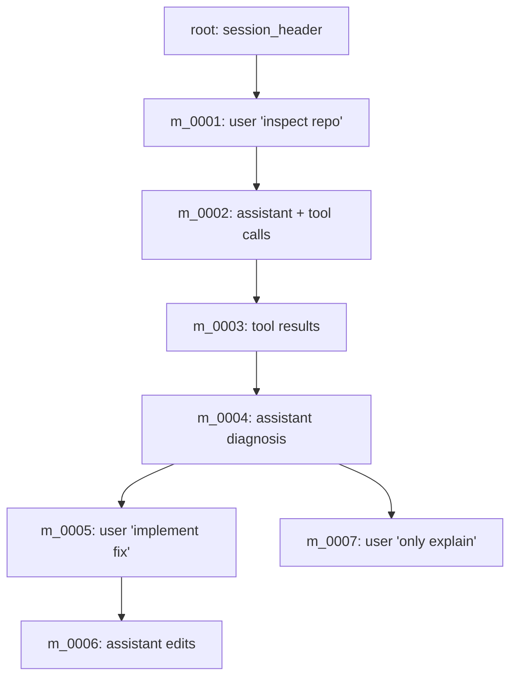
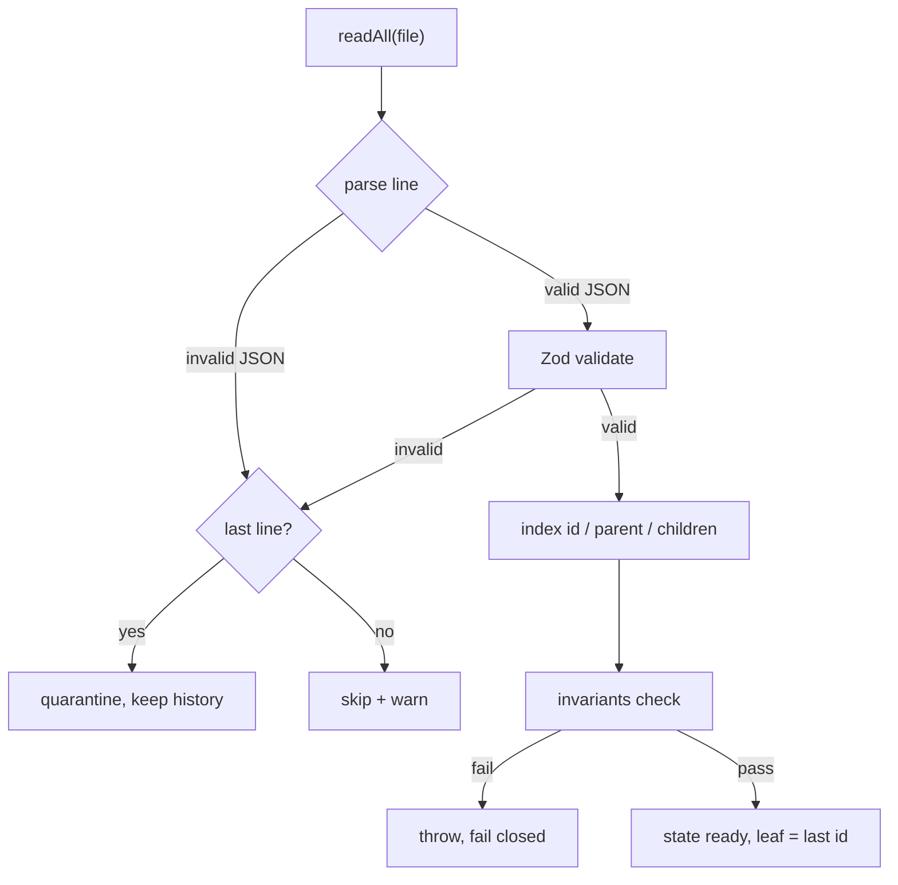

# 02 — Session Store (`@kern/session-store`)

Durable, append-only, branching conversation state. Two files do the work:
`jsonl-store.ts` (bytes on disk) and `session-manager.ts` (tree in memory),
with `invariants.ts` guarding correctness.

## 2.1 Why JSONL

One JSON object per line:

```jsonl
{"id":"root","parentId":null,"timestamp":"…","type":"session_header","version":1,"sessionId":"s_c5c7…","cwd":"/tmp/ws","createdAt":"…"}
{"id":"m_0001","parentId":"root","timestamp":"…","type":"message","message":{"role":"user","content":[{"type":"text","text":"Hello"}]},"seq":1}
{"id":"m_0002","parentId":"m_0001","timestamp":"…","type":"message","message":{"role":"assistant","content":[]},"seq":2}
```

- Append one event without rewriting the document.
- Crash mid-write corrupts at most the last line → quarantine it, keep history.
- Inspectable with shell tools; streamable; per-entry versioning; natural fit
  for event sourcing; branch references stay trivial (`parentId`).

Storage layout: `~/.kern/agent/sessions/<encoded-cwd>/<timestamp>_<sessionId>.jsonl`.
The cwd encoding is reversible and human-debuggable (not a bare hash).

## 2.2 The tree

Linear transcripts cannot preserve alternate paths. Every entry (except the
header) names its causal parent, so the log is a tree:



`activeLeafId` selects which path becomes model context. Navigating to an old
node (`branchTo`) moves the leaf **without deleting descendants** — the next
message appends a new child of the selected entry and the old future stays
inspectable. Forking to a new file copies only the root→selected path under
a fresh session id.

## 2.3 Load path



- Validation uses the protocol Zod schemas (`validateOnLoad`, default on).
- Only a trailing malformed/invalid line is quarantined (the
  crash-during-append signature). Mid-file corruption is skipped with a
  warning, never silently trusted.
- `lastSeq` is recomputed as the max `seq` seen, so appends continue the
  sequence after resume.

## 2.4 Invariants (`invariants.ts`, enforced on load)

| # | Invariant | Rationale |
|---|---|---|
| 1 | Exactly one root; `headerId` exists | A session has one origin |
| 2 | Every non-root entry's parent exists | No dangling history |
| 3 | Graph is acyclic (DFS from header) | Path reconstruction terminates |
| 4 | `activeLeafId` exists | Context always has a source |
| 5 | `seq` never decreases in load order | Cutoffs and replay stay meaningful |

Violation → throw, fail closed. Kern never continues a turn on corrupt
state. (Tool-call ↔ tool-result pairing is checked at context-reconstruction
time in agent-core.)

## 2.5 Manager API

| Method | Effect |
|---|---|
| `SessionManager.create(store, cwd)` | New file + header, leaf = root |
| `SessionManager.resume(store, cwd)` | Most-recent file for cwd, or create |
| `getActivePath()` | Root→leaf chain, cycle-guarded |
| `getActiveMessages()` | Message entries on the active path |
| `lastCompaction()` | Latest compaction entry on the active path |
| `getEntry(id)` | Point lookup (used for compaction cutoffs) |
| `branchTo(id)` | Move leaf, preserve all branches |
| `appendUserMessage / appendAssistantMessage / appendToolResult` | Persist + index + advance leaf, assign `seq` |
| `appendCompaction / appendDiagnostic / appendBranch` | Same bookkeeping for non-message entries |

`appendToolResult` delegates to `appendAssistantMessage` — tool results are
messages with role `tool`, keeping one code path for persistence ordering.
