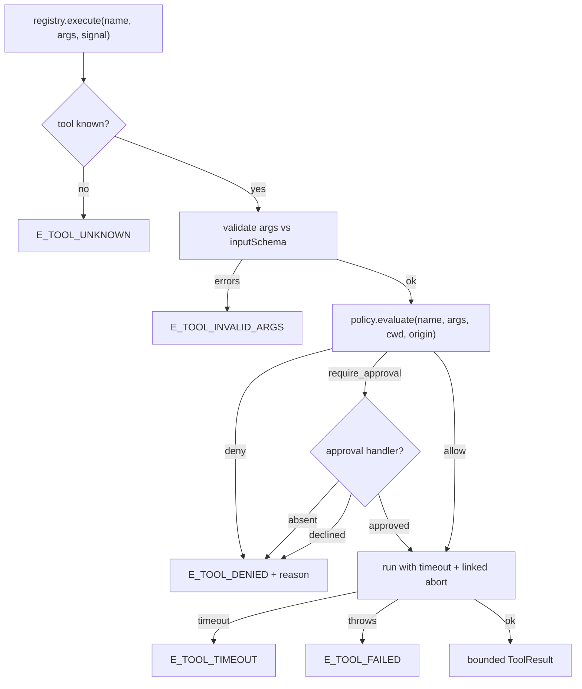
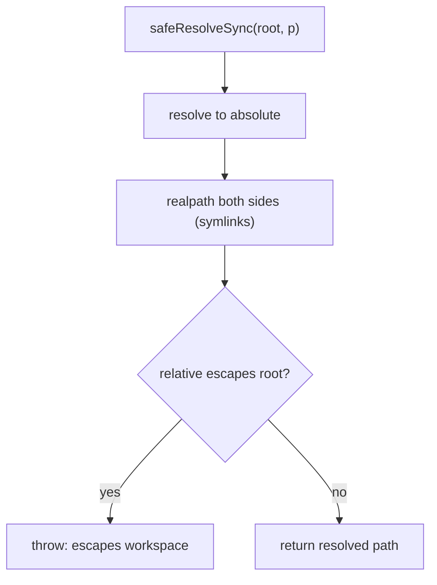

# 03 — Tools (`@kern/tools`)

Capabilities granted to the model. The registry is the **only** place where
capability and policy are decided — agent-core never special-cases tool
names. Files: `tools.ts` (registry + built-ins), `policy.ts`,
`policy-config.ts`, `validate-args.ts`, `path-safety.ts`.

## 3.1 Execution pipeline



Order matters: **validation → policy → execution**. The model can emit bad
shapes; tools fail with structured codes the model can read, never raw
exceptions. Every denial carries a reason.

`ExecuteOptions` carries `origin` (`model | user | extension`) and an
optional per-call approval handler; a registry-level handler is the
fallback. Headless deployments omit handlers entirely → approvals deny
(fail closed).

## 3.2 Policy engine (`DefaultPolicy` + `PolicyConfig`)

Deny-by-default with explicit, per-capability grants:

| Check | Behaviour |
|---|---|
| `denylistTools` contains tool | Deny |
| `allowlistTools` non-empty and missing tool | Deny |
| `blockSensitivePaths` and `args.path` matches (`.ssh/`, `.aws/`, keys, `.env*`, …) | Deny |
| `bash` command matches destructive patterns (`rm -rf`, `find … -delete`, `git reset --hard`, fork bomb, …) | Require approval (always, even if `approvalMode: never` is not a thing — there is no global unsafe switch) |
| `bash` with `approvalMode: ask` | Require approval |
| `write`/`edit` with `approvalMode: ask` | Require approval |
| otherwise | Allow |

`PolicyConfig` defaults (conservative): `approvalMode: ask`,
`autonomyLevel: supervised`, `workspaceOnly: true`,
`enforceRealpath: true`, `blockSensitivePaths: true`,
`networkEnabled: false`, budgets 50 turns / 30 per-turn calls / 200 total /
10 min wall. Validated by `PolicyConfigSchema`.

## 3.3 Path safety (`path-safety.ts`)



`..` checks alone are insufficient — symlinks can smuggle escapes — so both
sides go through `realpath`. Failure **throws**; every tool converts it to a
denial. There is no silent redirect (the old "clamp to root" behaviour was
removed for exactly this reason).

## 3.4 Built-in tools

| Tool | Side effect | Guards |
|---|---|---|
| `read` | `read` | Escape → deny; binary (NUL byte) refused with size note; default 400 lines, hard cap 2000, output bounded |
| `write` | `write` | Escape → deny; payload cap 500 KB; refuses to overwrite without `overwrite: true`; refuses directory targets; records `changedPaths` |
| `edit` | `write` | Escape → deny; `oldText` must match exactly once unless `replaceAll`; reports replacement count + `changedPaths` |
| `bash` | `execute` | Own process group (`detached`, non-Windows); timeout or abort kills the **tree** (SIGTERM → SIGKILL after 2 s grace); stdout/stderr captured separately with 1 MB capture caps; result reports exit code, duration, truncation flags |

Registry timeout (`maxToolMs`, default 120 s) races execution and aborts the
tool signal — so even a tool that ignores its own timeout is stopped.
`bash` also enforces its own per-call timeout (cap 10 min).

## 3.5 Adding a tool (agent-type code, not kernel code)

```ts
registry.register({
  name: "web_fetch",
  description: "Fetch a URL as text",
  inputSchema: { type: "object", properties: { url: { type: "string" } }, required: ["url"] },
  sideEffect: "network",          // policy-relevant classification
  async execute(args, ctx) { /* …respect ctx.signal, bound output… */ },
});
```

Rules for new tools: validate-then-policy ordering is automatic; the tool
must honour `ctx.signal`, bound its output, never trust its inputs, and
declare an honest `sideEffect`.
