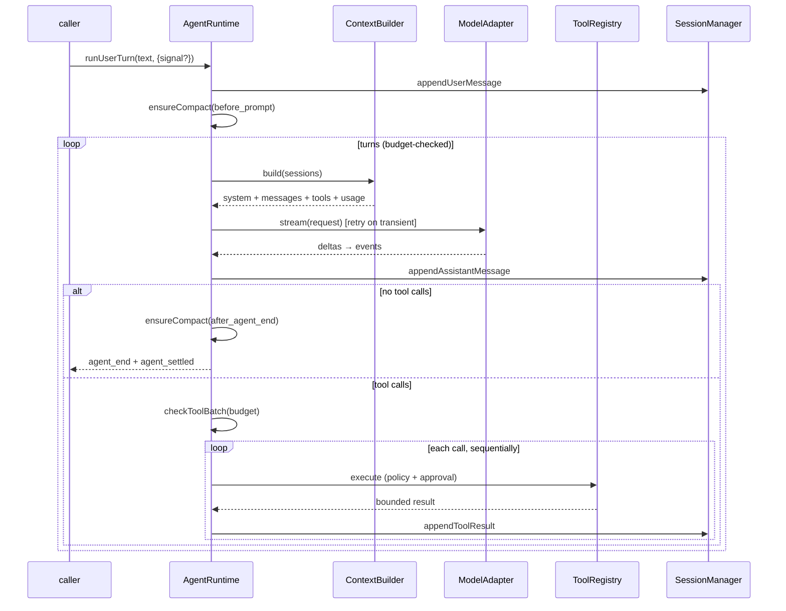
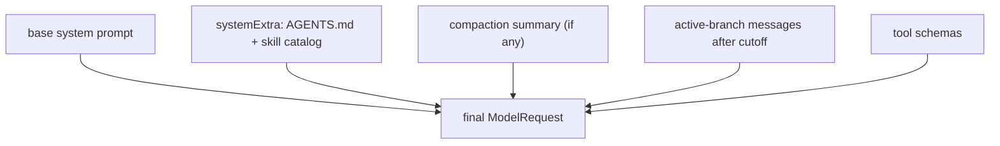
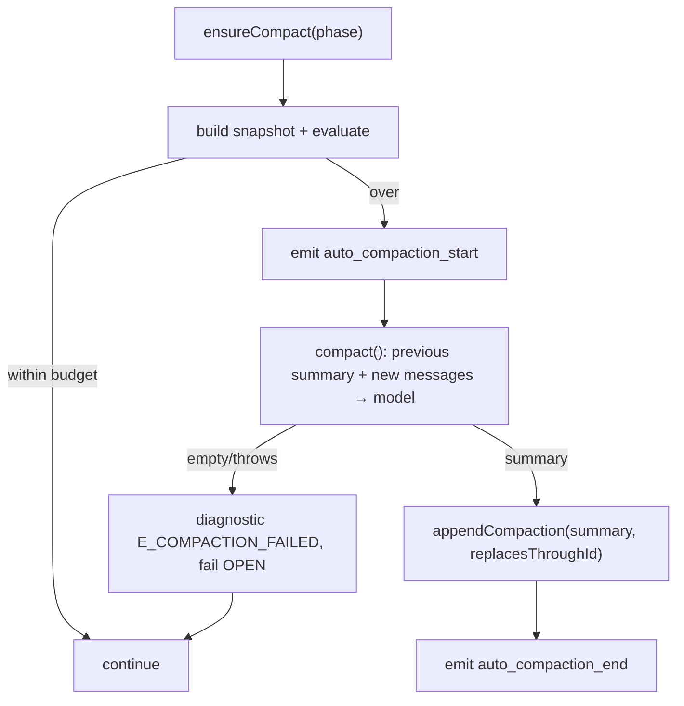

# 04 — Agent Core (`@kern/agent-core`)

The turn loop and everything it needs: context assembly, budgets, token
accounting, compaction, retry, and resource discovery. Files: `agent.ts`,
`context-builder.ts`, `tokens.ts`, `budgets.ts`, `compaction.ts`,
`retry.ts`, `resources.ts`, `event-bus.ts`.

## 4.1 The loop (`agent.ts`)

Responsibilities and deliberate limits:

- Turns are serialized; tool calls within a turn run **sequentially**
  (deterministic persisted order beats speed in v1; parallel read-only tools
  are a later, explicit step).
- Only finalized messages are persisted — never partial streams. Abort
  leaves no half-written assistant blob.
- `agent_end(reason)` vs `agent_settled`: the former marks a stop reason,
  the latter guarantees no automatic continuation remains.
- Errors become diagnostics (`E_*` codes) plus `agent_error`; cancellation
  becomes `agent_end(aborted)` plus an `E_CANCELLED` diagnostic — it never
  throws through to the caller as a crash.

## 4.2 Context assembly (`context-builder.ts` + `tokens.ts`)

Prompt layering, in fixed order:

- `systemExtra` is settable (`setSystemExtra`) — this is where
  `ResourceLoader` output lands. The builder never reads the filesystem.
- Compaction cutoff prefers `seq` (cutoff entry's seq vs message seq) and
  falls back to zero-padded id comparison for pre-`seq` entries.
- Every snapshot carries `ContextUsage` (`system + tools + messages`
  tokens). Counting is currently char-based (~4 chars/token, plus per-message
  framing) — an explicit estimate, documented as the first thing to replace
  with a real tokenizer or provider `usage` once adapters land.

## 4.3 Budgets (`budgets.ts`)

Hard caps, enforced in the loop, reported via `budgetUsage()`:

| Limit | Default | Checked |
|---|---|---|
| `maxTurns` | 50 | each turn |
| `maxToolCallsPerTurn` | 30 | before each tool batch |
| `maxTotalToolCalls` | 200 | before each tool batch |
| `maxWallTimeMs` | 10 min | turns, batches, tools |

Exceeded budget throws inside the turn → diagnostic + abort. Budgets are
the backstop behind every autonomy level: even "autonomous" cannot outrun
them.

## 4.4 Compaction (`compaction.ts`)

Gate: `S + T + H + R + M ≤ W` must hold, where `W` is the model's
`contextWindow`, `R` is `max(outputReserve 4000, 10% of W)`, and the trigger
threshold is 75% of `W`. `evaluate()` returns the verdict **with numbers**
so diagnostics are precise.

- Checked `before_prompt` and `after_agent_end` — the two Pi-style safe
  boundaries.
- Incremental: the previous checkpoint is fed back in, so the new summary
  is an update, not a lossy rewrite. Raw entries stay on disk; only the
  reconstructed view changes.
- The summary format is fixed (goal, constraints, workspace facts, progress,
  decisions, errors/blockers, next steps, critical artifacts) and must
  preserve exact paths, symbols, and error strings.
- Failure is deliberately fail-**open**: keep existing context, log, continue
  the turn. Losing the ability to act is worse than a large context.

Manual compaction is `compactor.compact(sessions, model, instructions?)`
— the `/compact` command will call exactly this.

## 4.5 Retry (`retry.ts`)

`withRetry(fn, classify, config, {onRetry, onSettled})`: exponential backoff
(initial 250 ms, ×2, cap 5 s) with ±10% jitter. Only transient
`ModelErrorKind`s retry (`rate_limit`, `timeout`, `network`, `overloaded`);
`auth`, `invalid_request`, `context_length`, and malformed responses never
do. The runtime maps retries to `auto_retry_start/end` events (the end
marker only fires when at least one retry happened).

## 4.6 Resources (`resources.ts`)

`ResourceLoader.load(cwd)` discovers, without ever executing:

- **Instructions**: `AGENTS.md` walking up from cwd (closest wins, depth
  capped, 20 KB cap per file).
- **Skills**: `.agents/skills/*/SKILL.md` and `.pi/skills/*/SKILL.md`,
  minimal `key: value` frontmatter (`name`, `description`,
  `allowed-tools`). Duplicates and unparsable skills become diagnostics,
  never crashes.

`buildResourceSection()` renders **catalog only** — names, descriptions,
paths — plus the standing instruction to `read` a skill's `SKILL.md` when
relevant. Full bodies never enter the prompt uninvited. Name collisions
resolve deterministically (first wins + diagnostic).
