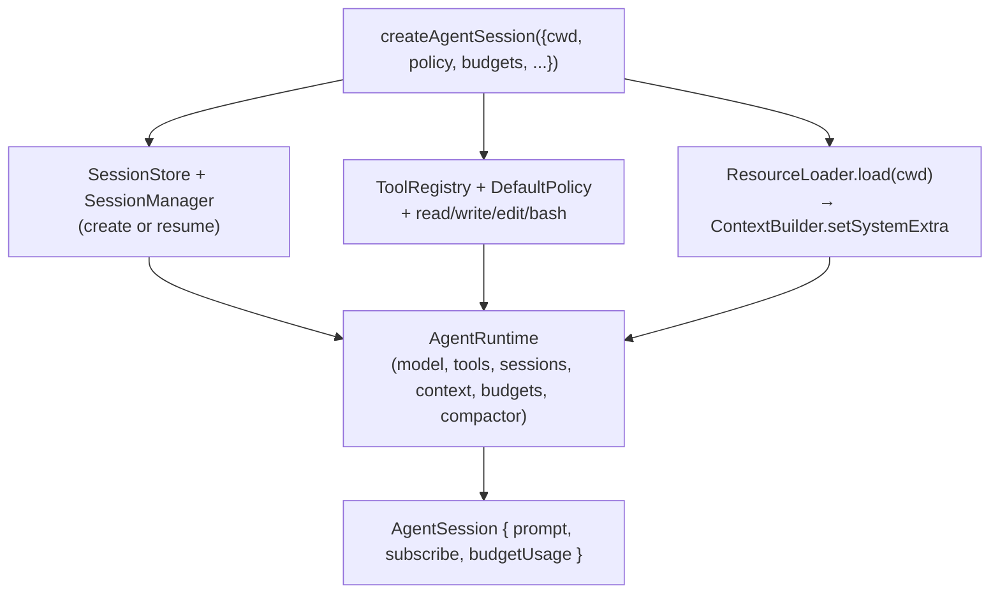
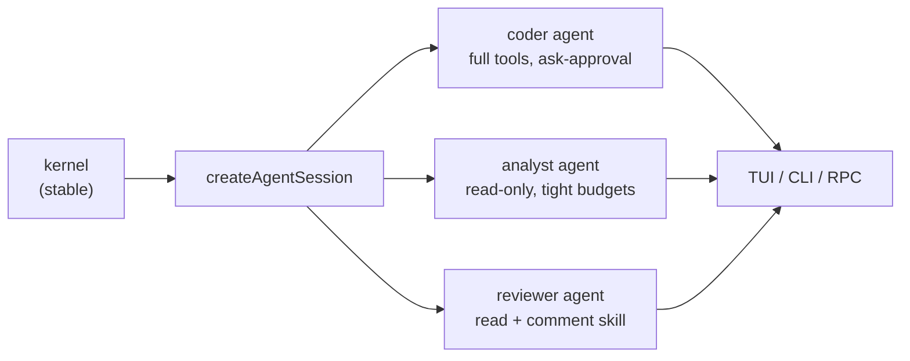

# 05 — Composition (`@kern/coding-agent`, `@kern/cli`)

How the kernel becomes a concrete agent. The rule: **agent types are
compositions of kernel pieces, never kernel edits.**

## 5.1 Facade (`createAgentSession`)

Options and their defaults:

| Option | Default | Meaning |
|---|---|---|
| `policy` | conservative `DEFAULT_POLICY_CONFIG` | Partial override of approval, allow/deny lists, autonomy |
| `budgets` | 50 / 30 / 200 / 10 min | Partial override of turn/call/time caps |
| `requestApproval` | absent (= deny) | Approval sink for write/exec/destructive ops |
| `loadResources` | `true` | AGENTS.md + skill catalog |
| `enableCompaction` | `true` | Automatic compaction at safe boundaries |
| `model` | no-op fake | Real adapter via `@kern/model` discovery (`createAdapterFor`); fake only when nothing is configured |
| `resume` | `false` | Resume most-recent session for cwd |
| `storageRoot` | `~/.kern/agent/sessions` | Override for tests and isolation |

`AgentSession` is the entire public surface: `prompt(text, {signal?})`,
`subscribe(listener)`, `budgetUsage()`, `isBusy()`, `setModel(adapter)`,
`modelInfo()`, `compact(instructions?)`, `contextUsage()`,
`approvalMode()` / `setApprovalMode(...)`, `allowToolForSession(tool)`,
`toolNames()`, `callToolAsUser(name, args)`. TUI, tests, and subagents all
build on these methods — never on kernel internals.

## 5.2 CLI (`@kern/cli`, print + interactive modes)

Thin by design: parse flags → resolve model via `@kern/model` →
create session → subscribe → prompt (print) or hand off to `@kern/tui`
(interactive, the default on a TTY with no prompt).
Flags: `--read-only`, `--max-turns N`, `--cwd DIR`,
`--no-resources`, `--no-compaction`, `--resume`, `--interactive/-i`,
`--print`, `--list-models`, `--provider NAME`, `--model [provider/]id`,
`--base-url URL`, `--api-key KEY`, `--help` (env: `KERN_PROVIDER`,
`KERN_MODEL`, `KERN_BASE_URL`, `KERN_API_KEY`; precedence
flag → env → config file).

Two rules the CLI follows that every UI must copy:

1. **Approval**: interactive TUI gets an arrow-key dialog (once /
   session / deny); print mode gets a TTY `[y/N]` prompt; non-TTY
   denies. Fail closed, always.
2. **Streams**: human text on stdout, machine/status on stderr. stdout stays
   clean for piping; this is what keeps future `--mode json` / RPC viable.

## 5.3 Building a new agent type

A new agent type (analyst, reviewer, researcher, …) is a small module that:

1. Calls `createAgentSession` with its own composition:
   - analyst → `policy: { allowlistTools: ["read"] }`, tight budgets
   - reviewer → read-only + a `comment` skill in `.agents/skills/`
   - researcher → registers a `web_fetch` tool (`sideEffect: "network"`)
     plus explicit network policy grants
2. Supplies its own system prompt section (via `systemExtra` or a wrapper
   around the builder) and its own skills directory.
3. Renders `AgentEvent`s in its own UI without touching kernel state.

If a second agent type cannot be built without editing kernel files, that
friction — not speculation — defines the next kernel seam. Generality is
earned from duplication, never guessed in advance.
