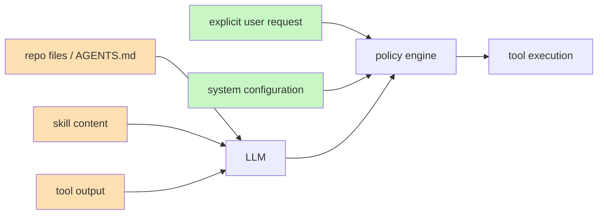

# 06 — Safety Model

Kern's safety does not depend on prompt wording. The model is treated as
**untrusted input to a mechanical policy layer**, never as authority.
Repository files, skills, tool output, and (future) web content are data,
not instructions.

## 6.1 Trust zones

Green is authority; amber is data; the policy engine sits between the model
and every side effect. Prompt-injection text in tool output can influence
wording but cannot grant capability — `rm -rf` still needs approval no
matter how persuasively the transcript asks.

## 6.2 Control surface (necessary only)

| Layer | Controls | Notes |
|---|---|---|
| Policy | allowlist/denylist per tool, `approvalMode`, destructive patterns, sensitive paths | Single source of truth; `origin` tracked per call |
| Autonomy | `manual / supervised / bounded / autonomous` + hard budgets | Budgets backstop every level — autonomy never outruns caps |
| Isolation | workspace-only + realpath, subprocess cwd pinned, network off | Containment over trust |
| Approval | session-scoped handler; TTY prompt or explicit callback; absent = deny | No persistent global allow; no "disable all safety" switch |
| Privacy | redaction on (keys, tokens, private keys, emails), sensitive-path reads blocked, no telemetry | Applied before persistence and before model context |
| Audit | full causal trace (`id`/`parentId`/`seq`), stable `E_*` codes, correlation via tool-call ids | Exportable as JSONL, replayable |

## 6.3 Defaults (non-negotiable)

- Approval `ask` for `write` / `edit` / `bash` / destructive; reads allowed.
- Destructive commands always require approval — pattern-matched, no override flag.
- Sensitive paths blocked by default; per-path explicit allow only.
- Budgets conservative (50 turns, 30/turn, 200 total, 10 min).
- Deny-by-default for anything not explicitly allowed, with a reason.
- Granular per-capability grants; **no global unsafe mode**.

## 6.4 Failure posture

| Failure | Posture | Why |
|---|---|---|
| Path escape | fail closed (deny) | Acting on the wrong files is worse than refusing |
| Invalid tool args | fail closed (structured error to model) | Model retries with corrected args |
| Corrupt session | fail closed (refuse to load) | Never reason on broken history |
| Compaction failure | fail **open** (keep context, continue) | Losing the ability to act is worse than a large context |
| Missing approval handler | fail closed (deny) | Headless must not auto-approve |
| Extension error (future) | isolate, diagnose, continue core | Plugins must never crash the session |
