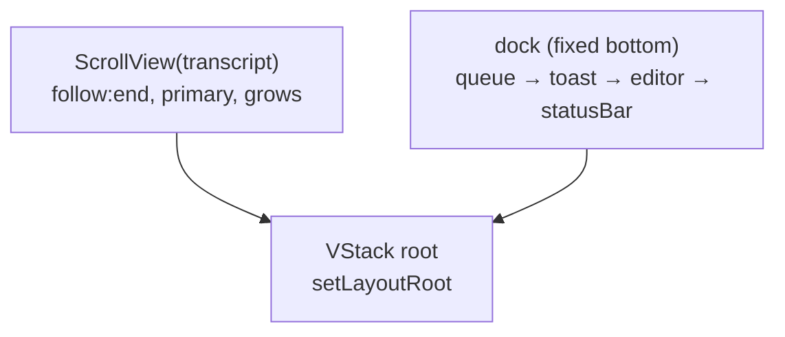

# 08 — TUI (`@kern/tui`)

Fullscreen Pi-style terminal UI on `@earendil-works/pi-tui` v1.1.0
(MIT): transcript streams into a scrollable viewport with the prompt
docked at the bottom; Pi's dark palette throughout. Five source files
(`index.ts`, `theme.ts`, `components.ts`, `autocomplete.ts`, `tui.ts`).
The TUI observes `AgentEvent`s and acts only through `AgentSession`
(+ `@kern/model` discovery for provider setup).

## Layout model (Pi's `createChatViewport` pattern)

- Fullscreen alt-screen (`TuiAltScreen`); exit restores the previous
  screen, so the farewell prints to stdout *after* `stop()`.
- Transcript (`Container`) holds Markdown replies, tool cards, loader,
  boxes; `ScrollView` follows the end and wheel-scrolls.
- Dock: queue panel (pending messages, cap 5) → toast line (4s
  transient notices; errors stay in the transcript) → pi-tui `Editor`
  (draws its own border — never wrapped in a `Box`) → `StatusBar`
  (`provider/model │ mode │ ctx% │ turns · calls · time`).
- Overlays float centered (`anchor: "center"`, 80% width): pickers,
  approvals, wizard steps, suggestions. Dialogs needing text input use
  the bare pi-tui `Editor` (its frame *is* the dialog frame);
  list dialogs are a titled `Box` around a `Text` header + `SelectList`.
- Overlay input: pi-tui focuses the overlay root, so each dialog is an
  `OverlayDialog` wrapper that forwards keys to the interactive child.
  The global `addInputListener` runs *before* focused components, which
  is how Esc-cancel (pi-tui `Editor` has no `onEscape`) and suggestion
  digits 1–3 are implemented.

## What's pi-tui's, what's Kern's

| pi-tui primitive | Used for |
|---|---|
| `TuiAltScreen`, `ProcessTerminal` | Renderer, raw mode, alt-screen, mouse/wheel |
| `Editor` | Main prompt + dialog inputs (wrap, kill ring, undo, IME, paste, dropdown) |
| `CombinedAutocompleteProvider` | `/command` + fuzzy `@file` completion (`fd` binary for files) |
| `SelectList` | Model picker, wizard steps, approvals, history, recovery, suggestions |
| `Markdown` (`marked` parser) | Assistant replies, with our highlight/diff theme |
| `Loader`, `Container`/`Text`/`Spacer`, `VStack`, `ScrollView` | Spinner, layout, scroll |
| `matchesKey`, `visibleWidth`/`truncateToWidth` | Input matching, width math |

Kern's own: Pi-dark `theme.ts` (okhsl tokens from Pi's `dark.json`
via `parseColor`+`styleText`), bordered `Box`, `StatusBar`, `ToolCard`
(`◈/✔/✖`, capped live output, diff hunks), and all of `tui.ts`
orchestration below. pi-tui's `Box` is padding-only (no borders) and
its `Text`/`Loader`/key-id shapes differ — that is why these pieces
stay Kern-side.

## Input

- `Enter` sends; `Shift+Enter`/`Alt+Enter`/`Ctrl+J` newline; `Tab`
  accepts completion; `↑↓` navigate dropdown/history.
- `Ctrl+C` abort (or clear draft), `Ctrl+D` twice exits,
  `Ctrl+Q` clears queue, `Backspace` on empty prompt pops queued item,
  `Ctrl+S` stash/restore draft, `Ctrl+R` history search,
  `Ctrl+L` redraw, `Shift+Tab` cycles `ask` ↔ `auto-allowlist`.
- `/command` ghost + dropdown; `@path` expands on submit to
  `<file path>content</file>` (40 KB cap; missing stays literal).
  Pasted invisible Unicode is stripped with a review-and-resend notice.
- `?` help, `!cmd` shell mode (output shown, agent responds to it).

## While a turn runs

Typing queues (cap 5, numbered, auto-sent in order); `Ctrl+C` aborts.
`Loader` shows activity + elapsed (`running bash`, `compacting
context`, `retrying (…)`); compaction/retry surface as toasts;
auth failure (`E_MODEL_AUTH`) renders a persistent card *plus* a
recovery dialog: Reconnect (`/connect`) / Retry turn / Switch model /
Dismiss — no dead ends.

## Approvals

Arrow-key dialog — *Yes, run once / Yes, always allow {tool} this
session / No (Esc)* — returning `true` / `"session"` / `false` through
the kernel approval hook. Runtime arguments pretty-printed (800ch cap);
destructive patterns (`rm -rf`, `git reset --hard`, …) render the
dialog in danger style but the turn continues on denial.

## Commands

`/help /model [filter] /models /keys /connect /compact [note] /diff
/new /export [file] /budget /clear /quit` (+ `/exit` alias).
`/connect` = preset → key method (paste / `$VAR` / `!cmd` / none) →
live `testProvider` with Edit-URL / Edit-key / manual-id recovery →
model pick → set-as-default → save (`models.json` + `auth.json`) →
instant switch. Esc cancels any step with nothing written.
`/new` swaps sessions; `/export` dumps the active path to markdown.
