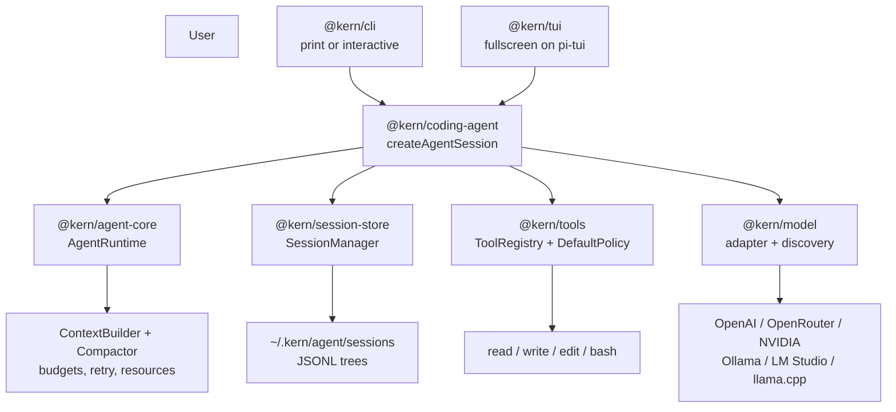
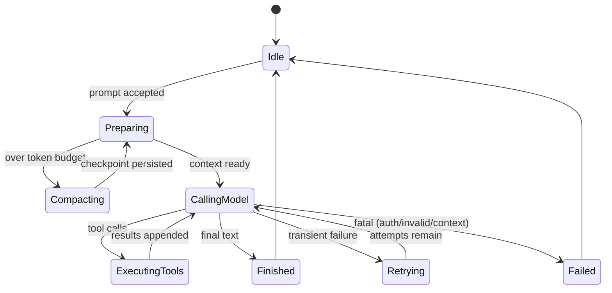

# Kern Kernel — From First Principles to Implementation

A detailed, implementation-oriented record of the **Kern** coding agent as
actually built in this repository: what each package does, the exact
contracts between them, the behaviors verified by tests and live runs,
and what is deliberately missing. Nothing in this document is aspirational
— every claim maps to source under `packages/` (verified at the commit
where the TUI moved onto `@earendil-works/pi-tui`).

> The one-sentence contract: given the same session branch, resources,
> model configuration, and tool results, Kern's state is understandable,
> inspectable, reproducible, and recoverable.

---

## Table of contents

| Ch | Title | Covers |
|---|---|---|
| 1 | [Mission and scope](#1-mission-and-scope) | What Kern is / is not, design philosophy |
| 2 | [System architecture](#2-system-architecture) | Real packages, dependency rules, invariants |
| 3 | [First-principles model](#3-first-principles-model) | Agent = LLM + State + Actions + Loop; state machine |
| 4 | [Repository layout](#4-repository-layout) | Actual file tree |
| 5 | [Protocol](#5-protocol--kernprotocol) | Messages, entries, events, errors |
| 6 | [Session store](#6-session-store--kernsession-store) | JSONL, tree, invariants, paths |
| 7 | [Tools and policy](#7-tools-and-policy--kerntools) | Registry, 4 tools, caps, DefaultPolicy |
| 8 | [Agent core](#8-agent-core--kernagent-core) | Loop, context layers, budgets, compaction, retry, resources |
| 9 | [Model layer](#9-model-layer--kernmodel) | OpenAI dialect, discovery, auth, presets |
| 10 | [Coding-agent facade](#10-coding-agent-facade--kerncoding-agent) | `createAgentSession`, full session API |
| 11 | [CLI](#11-cli--kerncli) | Interactive + print modes, flags, streams |
| 12 | [Terminal UI](#12-terminal-ui--kerntui) | pi-tui fullscreen dock, theme, commands, flows |
| 13 | [Safety model](#13-safety-model) | Trust zones, denials, destructive list, headless |
| 14 | [Project memory](#14-project-memory-agentsmd-and-skills) | AGENTS.md walk, skill catalog, on-demand reads |
| 15 | [Operations](#15-operations-sessions-branches-compaction) | Resume, export, branch infra, checkpoints |
| 16 | [Testing and verification](#16-testing-and-verification) | Unit tests, pty runs, typecheck |
| 17 | [Gaps and next](#17-gaps-and-next) | Tokenizer, coverage, second agent, RPC/MCP |
| 18 | [Checklists](#18-checklists) | Definition of done, per-change gates |

---

## 1. Mission and scope

### Objective

Kern is a **minimal, local-first terminal coding agent kernel**: it accepts
a user request from a terminal (interactive TUI or single-prompt print
mode), assembles context deterministically, calls any OpenAI-compatible
model, lets the model invoke tools, executes those tools under an explicit
mechanical policy, persists the full interaction as an append-only JSONL
session tree, and compacts long histories into structured checkpoints.

Implemented and verified:

- Turn loop with streaming, tool calls, budgets, retry, cancellation.
- Four tools: `read`, `write`, `edit`, `bash` — with validation, policy,
  path safety, output budgets, process-group kill.
- Durable branchable sessions (`~/.kern/agent/sessions`), resume, export.
- Model access to cloud (OpenAI, OpenRouter, NVIDIA) and local
  (Ollama, LM Studio, llama.cpp) servers through one OpenAI-compatible
  adapter; in-TUI `/connect` wizard with live endpoint testing.
- Fullscreen Pi-style TUI on `@earendil-works/pi-tui` (MIT): docked
  prompt, Pi dark theme, 12 slash commands, arrow-key approvals,
  auth-failure recovery, toasts, queue, suggestions.
- Project memory: `AGENTS.md` walk-up + skill catalog with on-demand reads.

### Non-goals (current)

- No RPC/JSON modes, no SDK packaging, no extension runtime, no MCP.
- No `grep`/`find`/`ls` tools (only `read/write/edit/bash` exist).
- No session-tree browser UI (`/tree`, `/fork` do not exist; the tree
  infra exists, the navigation UI does not).
- No `/skill:name` command (skills load via catalog + model `read`).
- No web browsing, no autonomous multi-agent behavior, no GUI.
- No opaque vector-memory; no custom model training.

---

## 2. System architecture

Two layers, separated by the `AgentSession` API:

1. **Kernel runtime**: model calls, tool calls, message state, budgets,
   compaction, retry, sessions, resources. Never imports TUI/CLI.
2. **Presentations**: interactive fullscreen TUI and single-prompt print
   CLI. They observe typed `AgentEvent`s and act only via `AgentSession`
   (+ `@kern/model` discovery for provider setup).



### Architectural invariants (enforced, not wished)

- The runtime never depends on the TUI or CLI (`agent-core` imports
  neither; verified by review + typecheck boundaries).
- Persistence is append-only; every durable entry carries `id`,
  `parentId`, `timestamp`, `seq`.
- Tool execution is observable as first-class events
  (`tool_execution_start/update/end`).
- Context is deterministic from durable state + named resources.
- The model adapter isolates all provider specifics; core sees only
  normalized `ModelStreamEvent`s.
- Tool output is bounded before entering model context (30 KB / 400
  lines default).
- Compaction preserves actionable state (paths, errors, decisions),
  never just prose; raw history stays on disk.
- Skills are optional catalog metadata, never hardcoded runtime logic.
- The UI renders events; it mutates nothing except through the session API.

---

## 3. First-principles model

An LLM emits tokens. Kern adds the other three quarters:

\[
\text{Agent} = \text{LLM} + \text{State} + \text{Actions} + \text{Control Loop}
\]

- **LLM** proposes the next action or a final response (any
  OpenAI-compatible endpoint via `@kern/model`).
- **State** is the session tree + budgets + policy + resources
  (`@kern/session-store`, `@kern/agent-core`).
- **Actions** are exactly four tools (`@kern/tools`).
- **Control loop** (`AgentRuntime.runUserTurn`) converts each model
  response into a final message or approved tool executions followed by
  another model call, until stop, budget, abort, or fatal error.



Turns serialize (one at a time); streaming deltas flow to subscribers
while the turn runs; `agent_settled` marks no further automatic
continuation (queued user messages aside).

---

## 4. Repository layout

The actual tree (TypeScript monorepo, `pnpm`, Node ≥ 20):

```text
kern/
├── package.json                  # scripts: typecheck, test (vitest), kern (tsx)
├── pnpm-workspace.yaml
├── tsconfig.json
├── Guide.md                      # user guide
├── userguidmanual.md             # full manual
├── Kern-Kernel.md                # this file
├── .agents/docs/00-08-*.md      # kernel design docs
└── packages/
    ├── protocol/src/             # core.ts model.ts tools.ts schemas.ts util.ts event-bus.ts index.ts
    ├── session-store/src/        # jsonl-store.ts session-manager.ts invariants.ts index.ts
    ├── tools/src/                # tools.ts policy.ts policy-config.ts path-safety.ts validate-args.ts index.ts
    ├── agent-core/src/           # agent.ts context-builder.ts budgets.ts compaction.ts retry.ts tokens.ts resources.ts event-bus.ts index.ts
    ├── model/src/                # openai.ts discovery.ts index.ts
    │   └── test/discovery.test.ts# 20 unit tests
    ├── coding-agent/src/         # create-agent-session.ts index.ts
    ├── cli/src/                  # main.ts
    └── tui/src/                  # tui.ts theme.ts components.ts autocomplete.ts index.ts
```

Dependency direction: `protocol` ← everything; `session-store`,
`tools`, `agent-core`, `model` converge on `coding-agent`;
`cli` and `tui` consume the facade (`tui` additionally consumes
`model` discovery). The TUI's only third-party dependency is
`@earendil-works/pi-tui` (MIT).

---

## 5. Protocol (`@kern/protocol`)

Zero-dependency contracts. Source:
`packages/protocol/src/{core,model,tools,schemas,util,event-bus}.ts`.

- **Messages**: `ChatMessage{role, content: ContentBlock[], timestamp}`.
  Roles: `user | assistant | tool`. Blocks: `text | reasoning |
  tool_call{id,name,arguments?} | tool_result{toolCallId,content,
  isError,details{durationMs,exitCode,truncated,changedPaths}}`.
- **Session entries** (durable, `SESSION_ENTRY_VERSION = 1`):
  `session_header{sessionId,cwd,meta?} | message | compaction{
  summary,replacesThroughId,tokensAfter?} | model_change{provider,
  model,thinkingLevel?} | label | branch{forkedFromId} | extension |
  diagnostic{severity,code,message}`. Helpers `isMessageEntry`,
  `isCompactionEntry`; Zod schemas + safe validators in `schemas.ts`.
- **Agent events** (the TUI's entire input): `session_start`,
  `turn_start`, `message_start`, `text_delta`, `reasoning_delta`,
  `message_end`, `tool_execution_start/update/end`,
  `auto_compaction_start{phase: before_prompt | after_agent_end}/end`,
  `auto_retry_start/end`, `agent_start/end/error/settled`,
  `session_diagnostic`. Delivered via `AgentEventBus` (subscribe
  try/catch + log; returns `Unsubscribe`).
- **Errors**: `KernError{code: DiagnosticCode, retryable,
  kind?: ModelErrorKind, details?}` with `KernError.model(...)` factory.
  Retryable: `rate_limit | timeout | network | overloaded`. Fatal:
  `auth | invalid_request | context_length | malformed_response |
  cancelled | unknown`. `diagnosticCodeForModelError()` maps kinds to
  `E_MODEL_*`; tool/session/resource/compaction codes exist alongside.
- **Tools**: `ToolDefinition{name,description,inputSchema,
  sideEffect: read|write|execute|network, execute(args,ctx)}`,
  `ToolContext{cwd,workspaceRoot,signal,requestApproval?,
  emitProgress}`, `ToolPolicyEngine.evaluate(): allow | deny{reason} |
  require_approval{prompt}`, output budgets (`DEFAULT_OUTPUT_BUDGET:
  30_000 bytes, 400 lines`), `boundText()` (head 60% + tail +
  truncation marker).
- **Util**: `newId`/`newSessionId(s_*)`, `createLogger`/`nullLogger`
  (stderr sink), `redact()` (sk-/gh*/AKIA/private-key/api-key/emails),
  `SENSITIVE_PATHS` + `isSensitivePath()`.

---

## 6. Session store (`@kern/session-store`)

Source: `jsonl-store.ts`, `session-manager.ts`, `invariants.ts`.

- **On disk**: `~/.kern/agent/sessions/<project-slug>/
  <timestamp>_<s_id>.jsonl`, one JSON object per line, append-only.
  `sessionDirFor(cwd)`: `~`-relative paths become `-home-<dash-path>`,
  else absolute-path dashed and sanitized (human-debuggable, no bare
  hashes). Blank lines skipped; a malformed *trailing* line is
  quarantined, history kept; `validateOnLoad` via safe Zod validators.
- **In memory**: `SessionState{entries,children,activeLeafId,headerId,
  lastSeq}` tree. `create()` / `resume()` (fallback create; rebuilds
  maps, runs `validateInvariants`: header/leaf exist, no cycles, single
  root, parents exist, non-decreasing `seq`).
- **Appenders** (all `newId`-stamped, `parentId = activeLeaf`,
  `seq = ++lastSeq`, persisted, leaf advanced): `appendUserMessage`,
  `appendAssistantMessage`, `appendToolResult`, `appendModelChange`,
  `appendCompaction`, `appendDiagnostic`, `appendBranch`,
  plus readers `getActivePath()`, `getActiveMessages()`,
  `lastCompaction()`, and `branchTo(id)` (rewind leaf; descendants kept).
- **Branching reality**: the tree supports forks today; there is no
  `/tree` navigation UI yet — new turns append to the active leaf.

---

## 7. Tools and policy (`@kern/tools`)

Source: `tools.ts` (registry + 4 built-ins), `policy.ts`,
`policy-config.ts`, `validate-args.ts`, `path-safety.ts`.

Pipeline per call: validate args → policy decision → approval if
required → execute with registry timeout (120 s default, aborts tool
signal) → bounded result. Error codes: `E_TOOL_UNKNOWN`,
`E_TOOL_INVALID_ARGS`, `E_TOOL_DENIED`, `E_TOOL_TIMEOUT`,
`E_TOOL_FAILED`.

| Tool | Args | Behavior |
|---|---|---|
| `read` | `path`, `offset?` (1-based), `limit?` (≤2000 lines) | Numbered lines or `- entry` directory listing; binary refused with size; always allowed |
| `write` | `path`, `content`, `overwrite?` (default false) | Parent dirs created; refuses dirs, existing-without-overwrite, payloads > 500 KB; reports `changedPaths` |
| `edit` | `path`, `oldText`, `newText`, `replaceAll?` | Exact match; refuses missing/ambiguous text; returns unified diff hunk (40-line cap) + replacement count |
| `bash` | `command`, `timeoutMs?` (≤600 s) | `bash -c` in workspace; process-group kill (TERM→KILL); exit code + duration + truncated stdout/stderr; 1 MB capture cap |

**`DefaultPolicy`** (`DEFAULT_POLICY_CONFIG`): `approvalMode: "ask"`,
`workspaceOnly`, `enforceRealpath`, `blockSensitivePaths`,
`denylist > allowlist`, destructive (`rm -rf`, `git reset --hard`,
`git clean -f`, fork bombs, `mkfs`, `dd … of=/dev/…`, `>/dev/…`,
`shutdown/reboot/halt/poweroff`, `DROP TABLE/DATABASE`) always
requires approval, session-allowlist supported. Symlink escapes fail
closed via `safeResolveSync`. `--read-only` composes
`allowlistTools: ["read"]`.

---

## 8. Agent core (`@kern/agent-core`)

Source: `agent.ts`, `context-builder.ts`, `budgets.ts`,
`compaction.ts`, `retry.ts`, `tokens.ts`, `resources.ts`, `event-bus.ts`.

- **Loop** (`agent.ts`): serialize turns → append user message →
  `ensureCompactIfNeeded("before_prompt")` → build context → stream
  model (assembler → `message_end`) → persist assistant → execute
  approved tool calls sequentially → append results → repeat; on
  final text emit `agent_end`, compact check
  (`"after_agent_end"`), always `agent_settled`. Denials return tool
  errors the model works around — turns continue, never die.
- **Context layers** (deterministic order): base system prompt
  ("You are Kern…") → `AGENTS.md` bodies → skill catalog →
  runtime facts → tool schemas → latest compaction summary →
  active-branch messages → user text.
- **Budgets** (`DEFAULT_BUDGET_LIMITS`): 50 turns · 30 calls/turn ·
  200 total calls · 10 min wall. `BudgetTracker` throws `E_INTERNAL`
  with the spent usage attached; `--max-turns N` overrides turns.
- **Compaction** (`Compactor{threshold: 0.75, outputReserve: 4000}`):
  fires when `tokens ≥ 75% of window − reserve`; the model writes the
  fixed checkpoint schema (Goal / Constraints / Workspace facts /
  Progress / Decisions / Errors / Next steps / Critical artifacts —
  exact paths, names, errors preserved); incremental updates reuse the
  prior checkpoint; raw entries stay on disk; failures are fail-open
  with diagnostics. Manual `/compact [note]`.
- **Retry**: only `rate_limit/timeout/network/overloaded`, with jitter
  and `auto_retry_start/end` events; auth/invalid/context-length never
  retried (auth opens the recovery dialog instead).
- **Tokens** (`tokens.ts`): explicit char-based estimator
  (`CHARS_PER_TOKEN`) — a documented placeholder until a real counter
  lands; provider `usage` (input/output/cacheRead/cacheWrite) is used
  when present.
- **Resources** (`resources.ts`): `ResourceLoader` walks `AGENTS.md`
  upward (closest wins, ≤4 files, 20 KB each) and skill dirs
  (`.agents/skills`, `.pi/skills`); only the catalog enters the prompt.

---

## 9. Model layer (`@kern/model`)

Source: `openai.ts`, `discovery.ts`; tests:
`test/discovery.test.ts` (20 passing).

- **One dialect**: `POST {baseUrl}/chat/completions`, `stream: true`,
  `include_usage: true`, `tool_choice: auto`. Covers OpenAI, OpenRouter,
  NVIDIA, Ollama, LM Studio, llama.cpp, and most proxies — no
  provider-specific code. Normalizes
  `text/reasoning/tool_call/usage/finished` events; maps stop reasons;
  classifies HTTP status into `KernError.model(...)` kinds;
  120 s default timeout; abort wired through.
- **Presets** (`PROVIDER_PRESETS`): openai, openrouter, nvidia
  (`integrate.api.nvidia.com/v1`), ollama (`:11434`), lmstudio
  (`:1234`), llamacpp (`:8080`), each with key env + hint.
- **Files**: `~/.kern/models.json` merged with
  `<project>/.kern/models.json` (providers override per name, model
  lists merge by id); literal secrets are *moved* to `~/.kern/auth.json`
  (0600) on save — config keeps only `$VAR` / `!cmd` references;
  `~/.kern/last-used.json` records the last model.
- **Credential precedence**: explicit flag → `auth.json` → `!command`
  (`sh -c`, 10 s) / `$VAR` / literal → `apiKeyEnv` / well-known env →
  loopback needs no key. `maskKey` for display; `testProvider` returns
  friendly failures (unreachable / key-rejected / timeout / bad-body)
  and never throws raw; `displayName` / `whitelist`→`blacklist`
  filtering applies to configured + live ids.

---

## 10. Coding-agent facade (`@kern/coding-agent`)

Source: `create-agent-session.ts`. `createAgentSession({cwd, logger?,
storageRoot?, policy?, budgets?, requestApproval?, loadResources?,
enableCompaction?, model?, resume?})` wires store → manager →
policy+registry (`read/write/edit/bash`, 120 s tool cap) → event bus →
context builder (+ resources) → runtime (+ compactor) and returns
`{session, manager}`.

Full `AgentSession` surface (the TUI uses all of it): `prompt(text,
{signal?})`, `subscribe(listener)`, `budgetUsage()`, `isBusy()`,
`setModel(adapter)`, `modelInfo()`, `compact(instructions?)`,
`contextUsage()`, `approvalMode()` / `setApprovalMode("ask" | "never"
| "auto-allowlist")`, `allowToolForSession(tool)`, `toolNames()`,
`callToolAsUser(name, args)` (user origin, same pipeline).

---

## 11. CLI (`@kern/cli`)

Source: `cli/src/main.ts`. Two modes: **interactive TUI** (default on a
TTY with no prompt, or `-i`) and **print** (positional prompt or
`--print`; streams text to stdout, status to stderr — pipe-safe).

Flags: `--read-only`, `--max-turns N`, `--cwd DIR`,
`--no-resources`, `--no-compaction`, `--resume`, `--interactive/-i`,
`--print`, `--list-models`, `--provider NAME`,
`--model [provider/]id`, `--base-url URL`, `--api-key KEY`, `--help`.
Env: `KERN_PROVIDER`, `KERN_MODEL`, `KERN_BASE_URL`, `KERN_API_KEY`,
`KERN_LOG=debug`. Precedence flag → env → config file. Unknown `--*`
throws. `--list-models` prints `provider/id [configured|live]`,
marking credential-less entries. Approval: TUI dialog when
interactive, TTY `[y/N]` in print mode, deny when headless.

---

## 12. Terminal UI (`@kern/tui`)

Source: `tui.ts` (orchestrator), `theme.ts`, `components.ts`,
`autocomplete.ts`, `index.ts` — on `@earendil-works/pi-tui` v1.1.0
(MIT), Pi's exact dark palette (`dark.json` okhsl tokens via
`parseColor`+`styleText`).

Pi-tui provides: `TuiAltScreen` renderer, `Editor` (wrap, kill ring,
undo, IME, paste, dropdown), `CombinedAutocompleteProvider`
(`/` + fuzzy `@file` via `fd`), `SelectList`, `Markdown` (`marked`),
`Loader`, `Container/Text/Spacer/VStack/ScrollView`, overlays,
`matchesKey`, width utils. Kern owns: theme roles, bordered `Box`,
`StatusBar`, `ToolCard`, and all orchestration. (pi-tui's `Box` is
padding-only and its key-id shapes differ — hence the split.)

Layout = Pi's `createChatViewport`: `ScrollView` transcript
(follow-end) over a fixed dock (queue → toast → editor → status bar);
dialogs float centered; the pi-tui `Editor` draws its own frame and is
never wrapped. Commands: `/help /model /models /keys /connect
/compact /diff /new /export /budget /clear /quit` (+ `/exit`, `?`,
`!shell`, `@mentions`). Global keys: `Ctrl+C` abort, `Ctrl+D`×2 exit,
`Ctrl+Q` clear queue, `Ctrl+S` stash, `Ctrl+R` history, `Ctrl+L`
redraw, `Shift+Tab` approval mode, digits fill suggestions (never
send). See `.agents/docs/08-tui.md` for the full flow reference.

---

## 13. Safety model

Mechanics, not wording. The model is untrusted input to the policy
engine; repo files, skills, tool output are data, never authority.

- Deny by default; `read` allowed, `write/edit/bash` ask (once /
  session / deny-Esc); destructive list always asks even in auto mode;
  sensitive paths (`.ssh .aws id_rsa .npmrc .netrc .env *.pem`) blocked;
  outside-workspace denied with symlink resolution; denylist wins.
- Headless runs deny (no one to ask). No global unsafe toggle exists
  and none will be added.
- Secrets: literal keys live only in `auth.json` (0600), are masked in
  summaries, never echoed in the TUI, and redacted from logs.

---

## 14. Project memory (AGENTS.md and skills)

`ResourceLoader.load(cwd)` runs at session start (and `/new`):
`AGENTS.md` walked upward (closest wins, ≤4, 20 KB each) is inlined;
skills are discovered in `.agents/skills` (+ `.pi/skills`) by
`SKILL.md` frontmatter (`name`, `description`, optional
`allowed-tools`) and advertised as **catalog only** (`name: description
(path: …)`). The model `read`s a body on demand; the system prompt
notes skills can be forced textually. Missing frontmatter →
diagnostic, skill skipped; duplicate names keep the first with a
diagnostic. `--no-resources` skips all of it.

---

## 15. Operations (sessions, branches, compaction)

- Sessions persist per turn to
  `~/.kern/agent/sessions/<slug>/<ts>_<s_id>.jsonl`; `--resume`
  continues the latest for the cwd; `/new` starts fresh (queue cleared,
  files re-indexed); `/export [file]` dumps messages, tool calls,
  compactions, model changes, branches to Markdown.
- The manager is a real tree (`branchTo`, `appendBranch`), but no
  tree-navigation UI exists yet — current turns extend the active leaf.
- Compaction is automatic at 75% of window (checks before each prompt
  and after each turn) or manual via `/compact [note]`; checkpoints
  follow the fixed schema in §8; `/budget` and the status bar show live
  usage; `/keys` re-authenticates a rejected key in place.

---

## 16. Testing and verification

- `pnpm typecheck` (`tsc --noEmit`) — clean, run after every change.
- `pnpm test` (`vitest`): 20/20 in `model/test/discovery.test.ts`
  (auth load/save/clear, masking, save validation, testProvider
  failures, filtering, last-used). Kernel policy/tree/compaction paths
  have no automated tests yet.
- Live pty runs (scripted input under `script(1)`, isolated `HOME`):
  boot → suggestions → submit → settle → quit; full `/connect`
  against a stub `GET /models` server (files land correctly split
  across `models.json`/`auth.json`); 401-stub auth-recovery dialog
  (Reconnect/Retry/Switch/Dismiss); fullscreen dock frame inspection
  (transcript rows 1–9, dialog 10–15, editor 21–23, status 24).

---

## 17. Gaps and next

In priority order, matching `.agents/docs/07-status.md`:

1. **Real tokenizer** — replace `CHARS_PER_TOKEN` estimation.
2. **Test coverage** — policy decisions, invariants, compaction
   cutoff, JSONL quarantine, TUI flows.
3. **Second agent type** (read-only analyst) to prove the kernel seam.
4. **Tree navigation UI** (`/tree`/`/fork`) atop the existing manager.
5. **RPC/JSON modes, extension runtime, MCP, subagents** — all fit
   behind `AgentSession`; build on evidence, not speculation.

---

## 18. Checklists

Per-change gates (every commit): typecheck clean; no speculative
generality; `protocol` dependency-free; `agent-core` UI-free; fail
closed (except compaction); secrets never in config/logs/echo.

Agent-complete checklist: core loop runs headless; TUI replaceable by
print mode; every interaction in JSONL; tree with `id`/`parentId`;
resume restores the branch; tool results causally ordered; schemas to
the model; bounded/redacted output; policy-gated writes/shell;
explicit context order; structured compaction preserving technical
facts; catalog-first skills; event-driven streaming UI. All hold —
except tree-navigation UI and RPC/SDK thin layers, which are the
honest gaps listed above.
